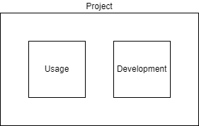

******************
Python Boilerplate
******************

This project as a starting point with common python best practices like:

* README.md project overview

  * Description
  * Technology used
  * Architecture Diagram
  * Setup Instructions
  * Development Instructions
  * Style Guidelines
  * Testing
  * Resources and References

* Virtual Environment
* Code Linting (isort, black, codespell)
* Pre-commit scripts configuration
* .gitignore
* requirements.txt and requirements_dev.txt
* LICENSE
* Contributing Standards
* Folder Structure

|architecture-overview|

Best practices
==============

The project uses the popular `flat-layout <https://setuptools.pypa.io/en/latest/userguide/package_discovery.html#flat-layout>`_ to organize packages and modules.

Setup
======

Setup instructions to use the project.

Core Infrastructure
-------------------

Configure the global variables

.. code-block:: bash

    # Globals
    rg_region=westus2
    rg_name=rg_example_$rg_region

    # Core VNet
    vnet_core=vnet-core-$rg_region
    vnet_core_prefix='10.0.0.0/16'
    subnet_app_name=snet-app
    subnet_app_prefix='10.0.255.0/27'

    # create resource group
    az group create -n $rg_name -l $rg_region

    # create core vnet
    az network vnet create -g $rg_name -n $vnet_core --address-prefixes $vnet_core_prefix
    az network vnet subnet create -g $rg_name -n $subnet_app_name --vnet-name $vnet_core  --address-prefixes $subnet_app_prefix

Development
===========

Setup your dev environment by creating a virtual environment

.. code-block:: bash

    # Windows
    # virtualenv \path\to\.venv -p path\to\specific_version_python.exe
    # C:\Users\!Admin\AppData\Local\Programs\Python\Python310\python.exe -m venv .venv
    # .venv\scripts\activate

    # Linux
    # virtualenv .venv /usr/local/bin/python3.10
    # python3.10 -m venv .venv
    # python3 -m venv .venv
    python3 -m venv .venv
    source .venv/bin/activate

    # Update pip
    python -m pip install --upgrade pip

    deactivate

Install dependencies and configure ``local.env``.

.. code-block:: bash

    # Install dependencies
    pip install -r requirements_dev.txt

    # Replace settings in local.env
    cp local.env.example local.env

Install locally for development and enable pre-commit scripts.

.. code-block:: bash

    pip install --editable .

    pre-commit install

Style Guidelines
----------------

This project enforces quite strict `PEP8 <https://www.python.org/dev/peps/pep-0008/>`_ and `PEP257 (Docstring Conventions) <https://www.python.org/dev/peps/pep-0257/>`_ compliance on all code submitted.

We use `Black <https://github.com/psf/black>`_ for uncompromised code formatting.

Summary of the most relevant points:

- Comments should be full sentences and end with a period.
- `Imports <https://www.python.org/dev/peps/pep-0008/#imports>`_  should be ordered.
- Constants and the content of lists and dictionaries should be in alphabetical order.
- It is advisable to adjust IDE or editor settings to match those requirements.

Use new style string formatting
-------------------------------

Prefer `f-strings <https://docs.python.org/3/reference/lexical_analysis.html#f-strings>`_ over ``%`` or ``str.format``.

.. code-block:: python

    # New
    f"{some_value} {some_other_value}"
    # Old, wrong
    "{} {}".format("New", "style")
    "%s %s" % ("Old", "style")

One exception is for logging which uses the percentage formatting. This is to avoid formatting the log message when it is suppressed.

.. code-block:: python

    _LOGGER.info("Can't connect to the webservice %s at %s", string1, string2)

Testing
--------
You'll need to install the test dependencies and project into your Python environment:

.. code-block:: bash

    pip3 install -r requirements_dev.txt
    pip install --editable .

Now that you have all test dependencies installed, you can run tests on the project:

.. code-block:: bash

    isort .
    codespell  --skip="./.*,*.csv,*.json,*.pyc,./docs/_build/*,./htmlcov/*"
    black main.py boilerplate
    flake8 main.py boilerplate
    pylint main.py boilerplate
    rstcheck README.rst
    pydocstyle main.py boilerplate

    python -m pytest tests
    python -m pytest --cov-report term-missing --cov=boilerplate tests/

Build Docker Images
-------------------

Build and run your image.

Run Docker Image locally

.. code-block:: bash

    docker build --pull --rm -f "dockerfile" -t python_boilerplate:latest "."
    docker run --rm -it python_boilerplate:latest

    # Run interactive with environment variables
    docker run --rm -it --env-file local.env python_boilerplate:latest

    #If you want to see STDOUT use
    docker run --rm -a STDOUT python_boilerplate:latest

Tag for remote registry

.. code-block:: bash

    $ACR_REGISTRY_NAME=remote_registry_name

    docker tag python_boilerplate:latest $ACR_REGISTRY_NAME.azurecr.io/python_boilerplate:v1

    az acr login --name $ACR_REGISTRY_NAME
    docker push $ACR_REGISTRY_NAME.azurecr.io/python_boilerplate:v4

Package and Deploy
------------------

After a successful build, packageing and deploying will:

- Bump Version
- Tag version in git
- Create Release in git
- Release to pypi

Bump Version
^^^^^^^^^^^^

Change the version in the following files:

- boilerplate/__init__.py

Tag Version
^^^^^^^^^^^

Commit, tag, and push the new version

.. code-block:: bash

    git commit -m "Bump version"
    git tag -a 0.0.1 -m "0.0.1"
    git push --tags

Create Release on GitHub
^^^^^^^^^^^^^^^^^^^^^^^^

- Create a new Release
- Name the Release the same as the tag name
- Auto-generate release notes.

Release to pypi
^^^^^^^^^^^^^^^

Upgrade to the latest version of setuptools and create package and test

.. code-block:: bash

    # Get latest versions
    python -m pip install --upgrade pip
    python -m pip install --upgrade build

    # Install it formally and build
    pip uninstall boilerplate
    python -m build

    # Distribute
    pip wheel .
    twine check dist/*

Upload the package to test first

.. code-block:: bash

    python -m twine upload --repository testpypi dist/*

Check that package looks ok. After testing, upload to the main repository

.. code-block:: bash

    python -m twine upload dist/*

References
==========
* Package Python Projects https://packaging.python.org/en/latest/tutorials/packaging-projects/

